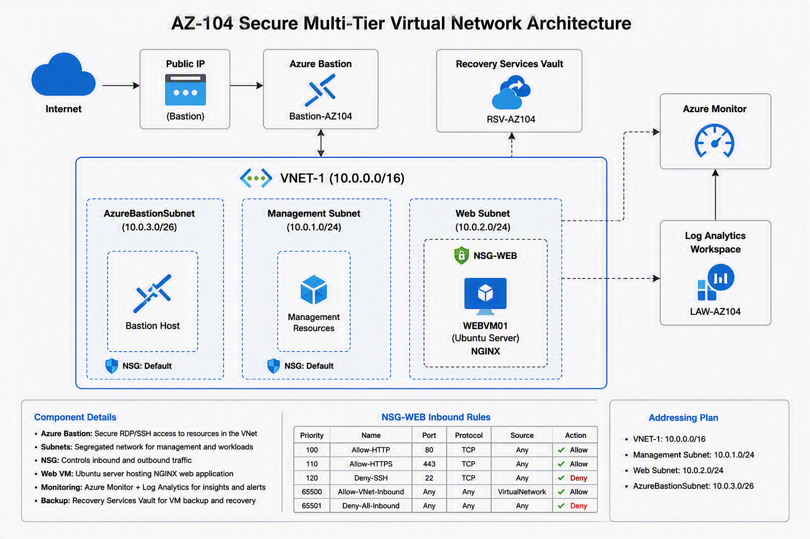
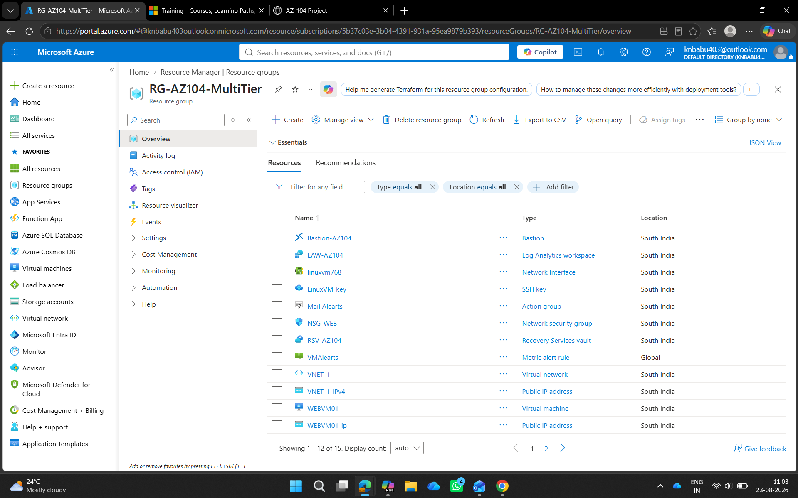
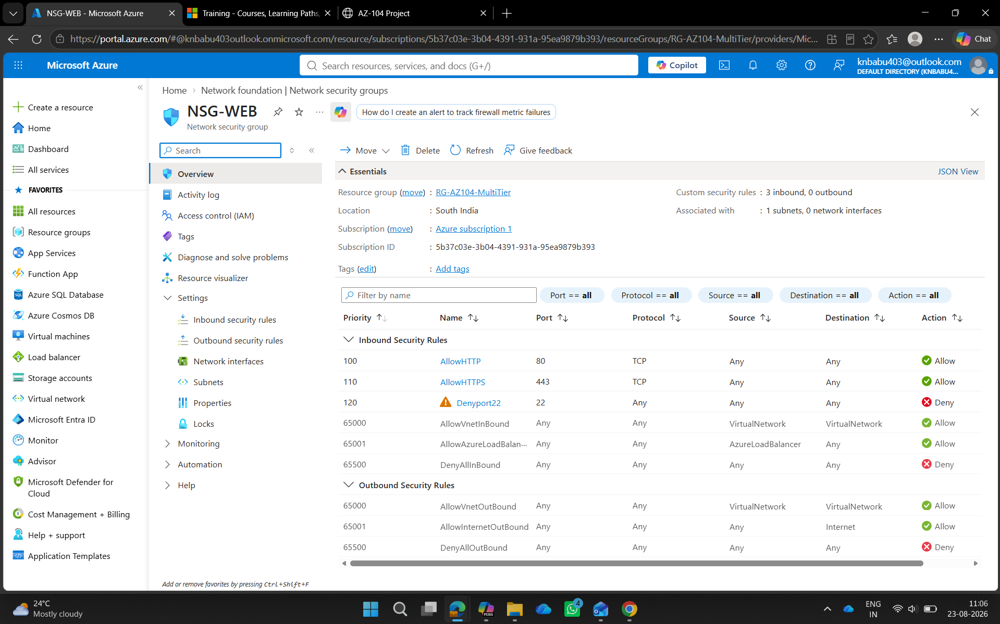
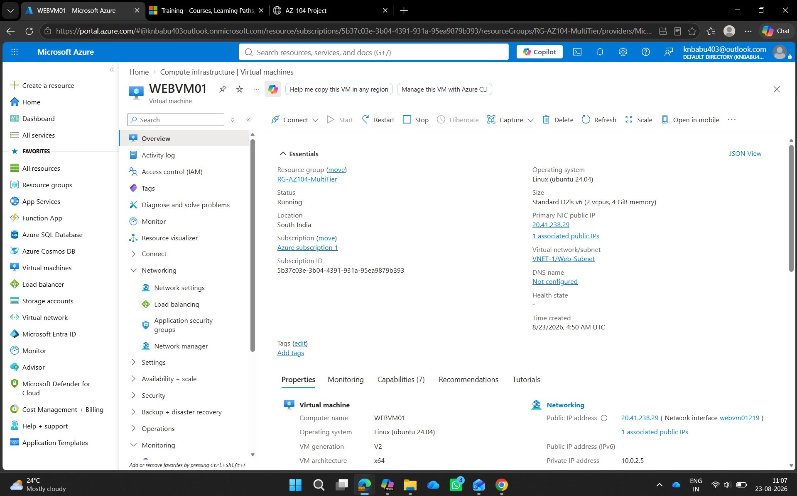
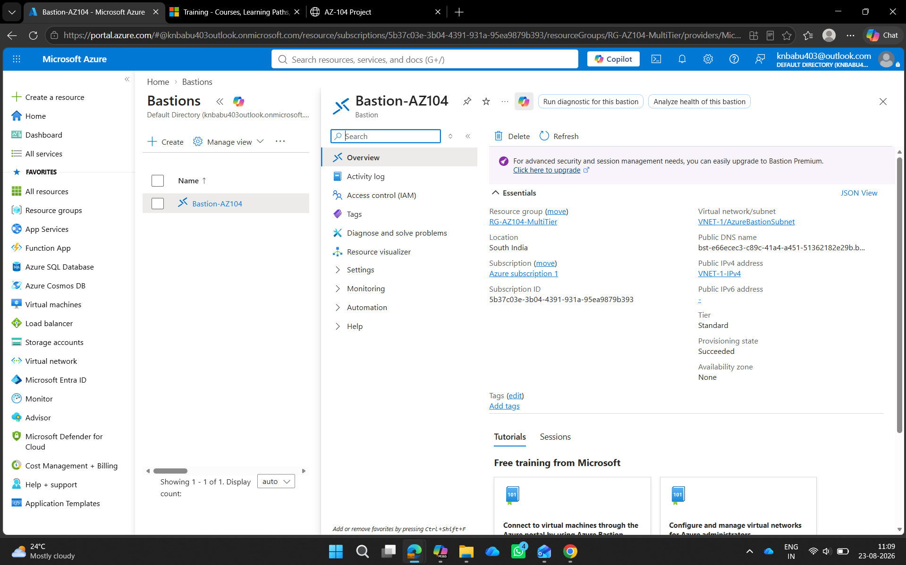
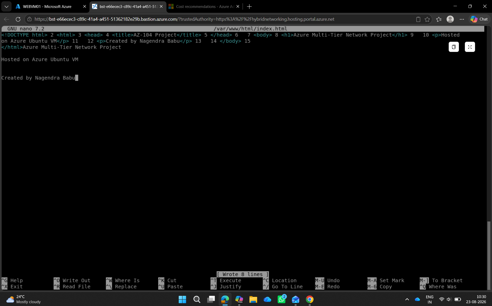
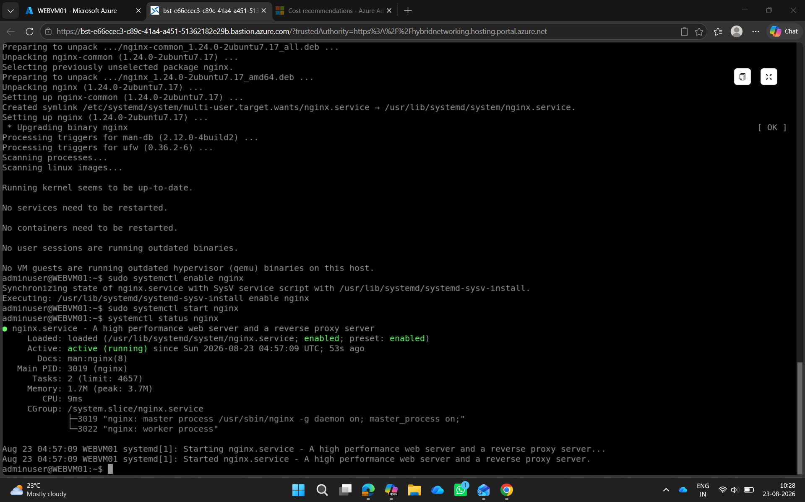
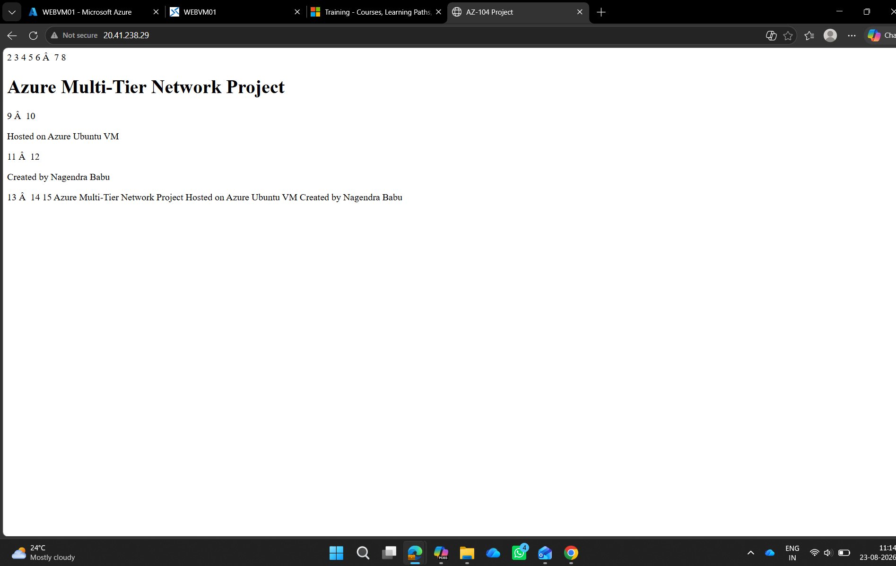
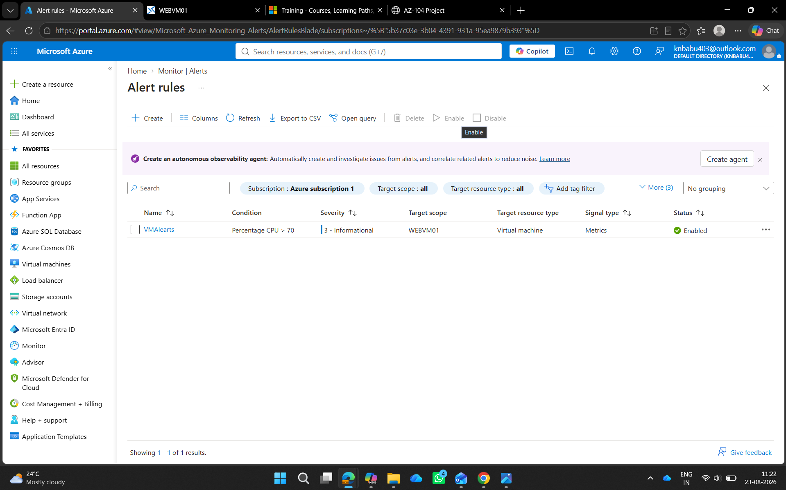
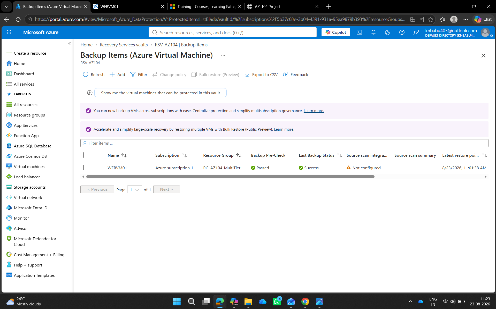

# Azure Secure Multi-Tier Virtual Network Project

## Overview

This project demonstrates Microsoft Azure Administrator (AZ-104) skills through the deployment of a secure multi-tier network infrastructure.

The solution includes:

- Azure Virtual Network
- Multiple Subnets
- Network Security Group
- Azure Bastion
- Ubuntu Linux Virtual Machine
- Azure Monitor
- Log Analytics Workspace
- Recovery Services Vault
- Azure Backup

---

## Architecture

---

## Architecture Components

### Resource Group

**RG-AZ104-MultiTier**

### Networking

- VNET-1 (10.0.0.0/16)
- Management Subnet (10.0.1.0/24)
- Web Subnet (10.0.2.0/24)
- AzureBastionSubnet (10.0.3.0/26)

### Security

- Azure Bastion
- NSG-WEB
- HTTP Allowed
- HTTPS Allowed
- SSH Restricted

### Compute

- Ubuntu Server 22.04 LTS
- WEBVM01
- NGINX Web Server

### Monitoring

- Azure Monitor
- Log Analytics Workspace

### Backup

- Recovery Services Vault
- Daily Backup Policy

---

## Deployment Steps

1. Created Resource Group.
2. Created Virtual Network and Subnets.
3. Configured Network Security Group.
4. Deployed Ubuntu Linux Virtual Machine.
5. Configured Azure Bastion.
6. Installed and configured NGINX.
7. Enabled Azure Monitor.
8. Connected Log Analytics Workspace.
9. Configured Alert Rules.
10. Enabled VM Backup using Recovery Services Vault.

---

## Screenshots

### Resource Group

### VNet Subnets

### NSG Rules

### Linux VM

### Azure Bastion

### Bastion Connection

### NGINX Running

### Website Hosted

### Alert Rule

### Backup Success

---

## Cost Optimization

Resources were deleted after successful testing and validation to avoid unnecessary Azure charges.

This approach demonstrates responsible cloud cost management while still validating the deployment and configuration of all required services.

---

## Skills Demonstrated

- Azure Administration
- Azure Networking
- Network Security Groups (NSG)
- Azure Bastion
- Linux Administration
- NGINX Web Server Deployment
- Azure Monitor
- Log Analytics Workspace
- Azure Backup & Recovery
- Monitoring & Alerting
- Infrastructure Management
- Troubleshooting

---

## Project Outcome

Successfully designed and deployed a secure multi-tier Azure infrastructure implementing networking, security, monitoring, and backup best practices aligned with Microsoft AZ-104 certification objectives.

---

## Author

**Nagendra Babu**

Desktop Engineer | Azure Administrator
